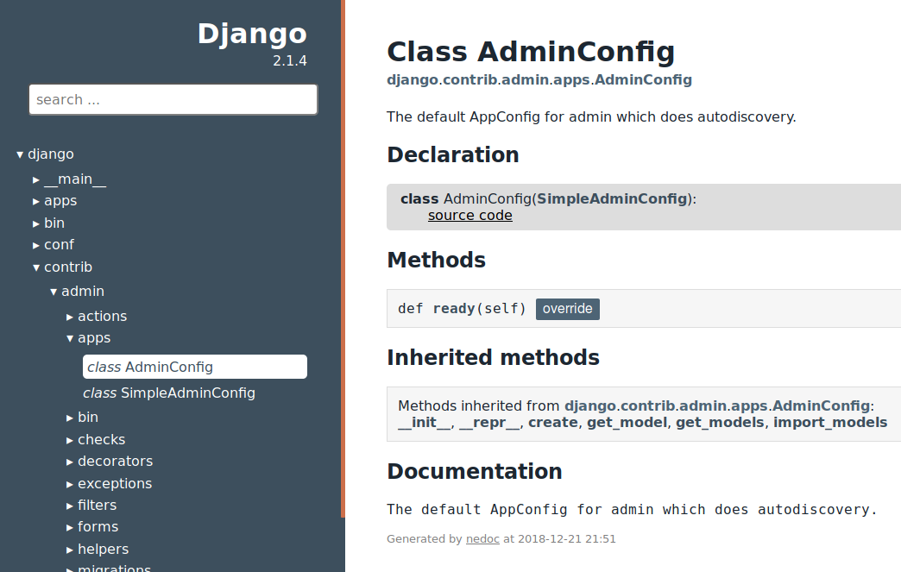

# Nedoc (Non-Evaluating Documentation)

*Nedoc* is a generator of API documentation for Python 3 with the following features:

* Your code is not executed; Your program and its dependencies do not have to be installed.
* Nedoc tracks which methods were overridden and show it in the documentation.
* Inheritance of docstrings for overridden methods is supported.
* Nedoc tracks what and where was reimported.
* Resulting documentation is a set of static HTML files.
* Supported docstring styles: numpydoc, google, rst
* Supported docstring markup: markdown, rst

## Examples

* *Django* documentation generated by Nedoc: https://spirali.github.io/nedoc-demo/django/django.html
* *Dask/Distributed* documentation generated by Nedoc: https://spirali.github.io/nedoc-demo/distributed/distributed.html



## Installation

```
$ pip3 install nedoc
```


## Getting started (short version)

```
python3 -m nedoc init MyProjectName /path/to/project
python3 -m nedoc build
firefox html/index.html
```

## Getting started (longer version)

First, we need to generate `nedoc.conf`; *PathToProject* should lead to the toplevel
directory with Python source codes (usually the directory containing toplevel
`__init__.py`; however, `__init__.py` does not have to exist).


```
python3 -m nedoc init <ProjectName> <PathToProject>
```

The command creates `nedoc.conf` in the current working directory. You can edit
it for more customized settings.

The documentation is built by the following command:

```
python3 -m nedoc build
```

By default, you can find the results in `html` directory.
